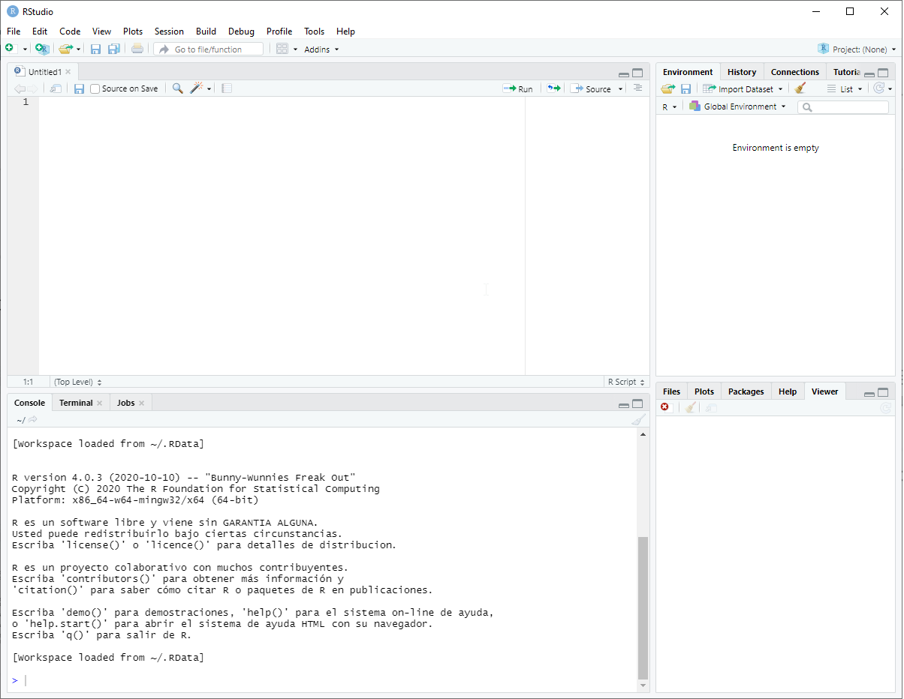
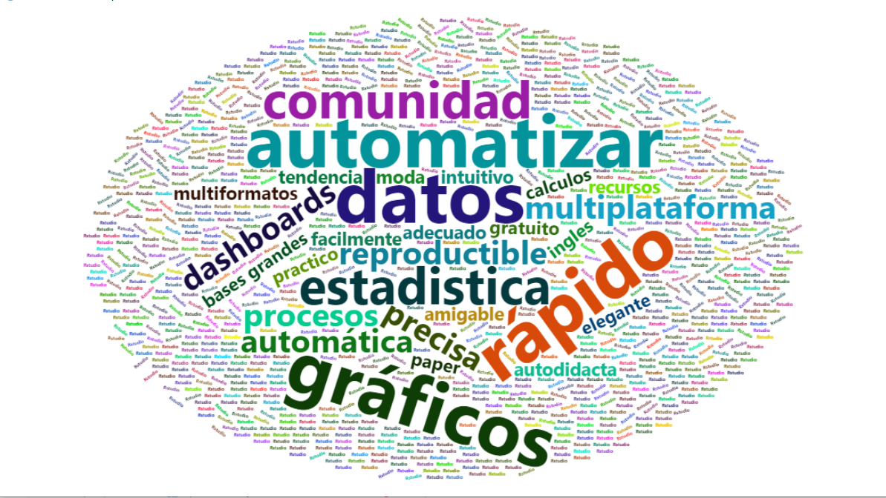
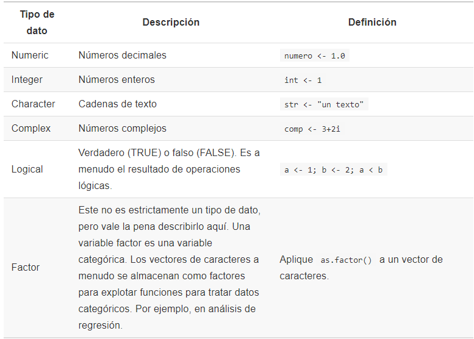
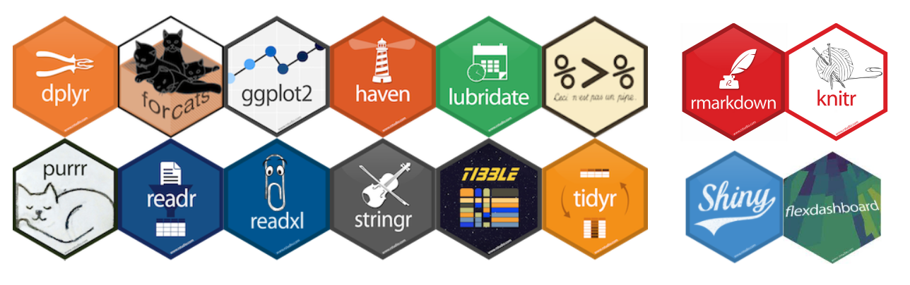
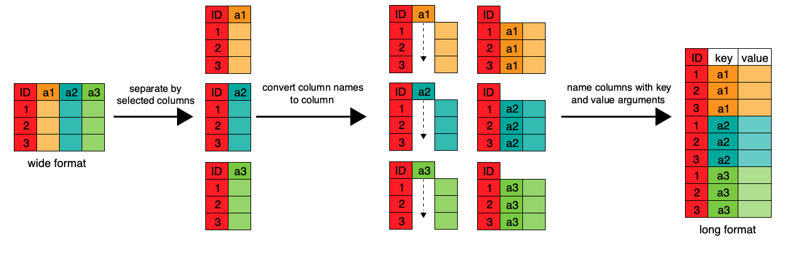

---
output:
  xaringan::moon_reader:
    seal: false
    css: [default2.css,rladie.css, rladies-font.css, custom.css]
    nature:
      ratio: 16:9
      highlightStyle: github
      highlightLines: true
      countIncrementalSlides: false
      slideNumberFormat: |
        <div class="progress-bar-container">
          <div class="progress-bar" style="width: calc(%current% / %total% * 170%);">
          </div>
        </div>
---

```{r xaringan-panelset, echo=FALSE}
xaringanExtra::use_panelset()
```

```{r xaringanExtra-clipboard, echo=FALSE}
xaringanExtra::use_clipboard()
```

```{r xaringanExtra-search, echo=FALSE}
xaringanExtra::use_search(show_icon = TRUE)
```

```{r xaringan-animate-css, echo=FALSE}
xaringanExtra::use_animate_css()
```

```{r setup, include=FALSE}
knitr::opts_chunk$set(fig.dim=c(5.5, 4.5), 
                      # fig.retina=2, 
                      out.width="100%",
                      dev="svg")
library(tidyverse)
library(ggplot2)
library(kableExtra)
library(tidyverse,warn.conflicts = F,verbose = F,quietly = T)
library(aweek)
```


background-image: url(imagenes/INICIAL.png)
background-size:100%
---
class: inverse, center, middle
background-image: url(imagenes/fondo_good.png)
background-size: cover
# Introducción al análisis de datos con

### JPierre Velásquez
.large[CDC | 19-08-2021]

```{css echo=FALSE}
.pull-left {
  float: left;
  width: 47%;
}
.pull-right {
  float: right;
  width: 47%;
}
.pull-right ~ p {
  clear: both;
}
```

---

class: center, middle, animated fadeOutLeft
layout: false


# Objetivos

</br>

### Explicar aspectos basicos de R y manipulación de datos

--

layout: false

### Conocer las librerias mas útiles (para análisis generales)

--

layout: false

### Conocer las principales funciones de la colección de librerias tidyverse

--

layout: false

### Aplicar lo aprendido en una base de datos


---
class: inverse,  center, middle

```{r, echo=FALSE, fig.cap="", out.width = '50%'}
knitr::include_graphics("https://thumbs.gfycat.com/GorgeousOrdinaryBooby-max-14mb.gif")
```


---
layout: false

background-image: url(https://bookdown.org/oscar_teach/estadistica_aplicada_con_r/r-rstudio.png)
background-position: 90% 7%
background-size: 15%

# Aspectos Básico

.panelset[
.panel[.panel-name[R y Rstudio]

**[R](https://www.r-project.org/)**: Es el lenguaje de programación, es libre (gratis) y de código abierto. [la interfaz resulta dura para muchos] 

**[Rstudio](https://www.rstudio.com/products/rstudio/download/)**: IDE de preferencia por la mayoria (una interfaz mucho mas agradable para programar)

.pull-left[

```{r, fig.align='right', echo=F, out.width='80%'}
# url
 
```

**[Cheatssheet Rstudio](https://github.com/rstudio/cheatsheets/raw/master/rstudio-ide.pdf)**

]

.pull-right[

`Consola:` Es aquí donde nuestro código es interpretado, **la consola de R es la interfaz entre R y nosotros**.

`Script:` Aqui se crean las lineas de código que posteriormente se ejecutarán en la consola.

`Enviroment:` Aqui se guardarán los objetos que vas a crear (vectores, listas, data frames, arrays y funciones).


`Como funciona R?:`

- Abrimos una sesión de R.
- En la sesión vamos a importar o crear objetos (todo en R es un objeto: vectores, tablas, funciones, etc.).
- Operamos aplicando funciones a los objetos y creando nuevos objetos.

]


]


.panel[.panel-name[¿Por qué usar R?]

```{r, eval = F, include=F}

library("wordcloud2")

palabras <- c('reproductible','adecuado','estadistica','datos','rápido','precisa','automatizar','facilmente','procesos','automática','gratuito','gráficos','gráficos avanzados','dashboards','multiplataforma','comunidad','practico', 'amigable', 'calculos', 'intuitivo', 'ingles','moda', 'tendencia','bases grandes',
              'multiformatos','recursos', 'autodidacta','paper','elegante',rep('Rstudio', 500))
frecuencia <- c(4,3, 5, 6, 6, 4, 6, 3, 4, 4, 3, 6, 6, 4, 4, 5, 3, 3, 3, 3, 3, 3, 3, 3, 3, 3, 3, 3, 3, rep(1.5, 500))**2
df <- data.frame(word = palabras, freq = frecuencia)
wordcloud2(data = df, size=0.5)

```

```{r, fig.align='center', out.width='75%', echo=F}
# url
 
```

]

.panel[.panel-name[Tipos de datos]

En R a un elemento o dato se le asigna una clase, entre las mas basicas tenemos:

```{r, fig.align='center', out.width='50%', echo=F}
# url
 
```

]

.panel[.panel-name[Estructuras]

**[R-base](http://github.com/rstudio/cheatsheets/raw/master/base-r.pdf)**

```{r, fig.align='center', out.width='80%', echo=F}
# url
knitr::include_graphics("https://hackernoon.com/images/pq5fk3z4t.jpg") 
```

]

.panel[.panel-name[Librerias]

**¿Que són?:** Una Libreria es una colección de funciones, datos y código R que se almacenan en una carpeta conforme a una estructura bien definida, fácilmente accesible para R.

**¿Como instalar una librería?**

`1) Si la librería esta en el CRAN`

```{r, eval=F}
install.packages('tidyverse')
```

`2) Si la librería esta en el GitHub`

```{r, eval=F}
remotes::install_github("avallecam/epitidy")
```

**Librerias con mayor uso (por mi)**

```{r, fig.align='center', out.width='45%', echo=F}
# url
 
```

]

]

---
class: inverse, center, middle

```{r, echo=FALSE, fig.cap="", out.width = '50%'}
knitr::include_graphics("https://psyteachr.github.io/msc-data-skills/images/memes/repro_reports.jpg")
```

---

layout: false

background-image: url(https://bookdown.org/oscar_teach/estadistica_aplicada_con_r/r-rstudio.png)
background-position: 90% 7%
background-size: 15%

# Manejo de datos

.panelset[
.panel[.panel-name[¿Qué es?]


Los datos que puedes encontrar disponibles en internet, repositorios o bases de datos, raramente están en el **formato necesario** para su análisis y necesitarás manipularlos antes de usarlos. `¡Esto puede llevar más tiempo que el análisis mismo!`

#### La mayoria de las acciones de manipulación se pueden realizar con el universo de paquetes del:


```{r, fig.align='center', out.width='40%', echo=F}
# url
knitr::include_graphics("https://jhudatascience.org/images/tidyverse.png") 
```

]

.panel[.panel-name[Importar archivos]

.pull-left[

### Algunos de los formatos mas comunes con sus respecivas funciones:

```{r, echo = F}
df_import <- data.frame('Formato de archivo' = c('csv','excel','txt','dbf'),
                        'Libreria' = c('-','readxl','-','foreign'),
                        'Ejemplo' = c('read.csv() o read.csv2()','read_excel()','read.table()','read.dbf()')) %>% 
  rename('Formato de archivo' = Formato.de.archivo)

df_import %>% 
   kbl() %>%
  kable_classic(full_width = F, html_font = "Cambria")
```

#### Ejemplo

```{r}
base_covid <- read.csv2('https://cloud.minsa.gob.pe/s/AC2adyLkHCKjmfm/download', encoding = 'UTF-8') 
```

]

.pull-right[

### Para ver el resumen de nuestra base de datos usamos str()

```{r}
str(base_covid) 
```

]

]

.panel[.panel-name[Funciones básicas]


.pull-left[

**[dplyr](https://www.rstudio.com/wp-content/uploads/2015/02/data-wrangling-cheatsheet.pdf)** clik para ir al cheatshhet

```{r, fig.align='center', out.width='69%', echo=F}
# url
knitr::include_graphics("https://biostat2.uni.lu/lectures/img/06/vaudor_dplyr_schema.png") 
```

]

.pull-right[

```{r}
# select()
df_2 <- base_covid %>% select(FECHA_CORTE, SEXO)
```

```{r}
# filter()
df_2 <- base_covid %>% filter(EDAD > 18)
```

```{r}
# arrange()
df_2 <- base_covid %>% arrange(EDAD)
```

```{r}
# mutate()
df_2 <- base_covid %>% mutate(EDAD_REAL = EDAD + 10)
```

```{r}
# summarise()
df_2 <- base_covid %>% summarise(edad_promedio = mean(EDAD, na.rm=T))
```

```{r}
# count()
df_2 <- base_covid %>% count(EDAD)
```

]

]

.panel[.panel-name[Funciones intermedias 1]

`group_by`: para agrupar en función de una variable   .

```{r, fig.align='center', out.width='42%', echo=F}
# url
knitr::include_graphics("https://swcarpentry.github.io/r-novice-gapminder/fig/13-dplyr-fig3.png") 
```

]

.panel[.panel-name[Funciones intermedias 2]

`gather()`: para pasar de columnas a filas (wide a long)

`spread()`: para pasar de filas a columnas (long a wide)

```{r, fig.align='center', out.width='100%', echo=F}
# url
 
```

]

]

---
class: inverse,  center, middle

# `¡Gracias por su atención!`

```{r, echo=FALSE, fig.cap="", out.width = '50%'}
knitr::include_graphics("http://wegamers.176.com/GameIM/SNS/Image/20402358211595235926405967")
```

