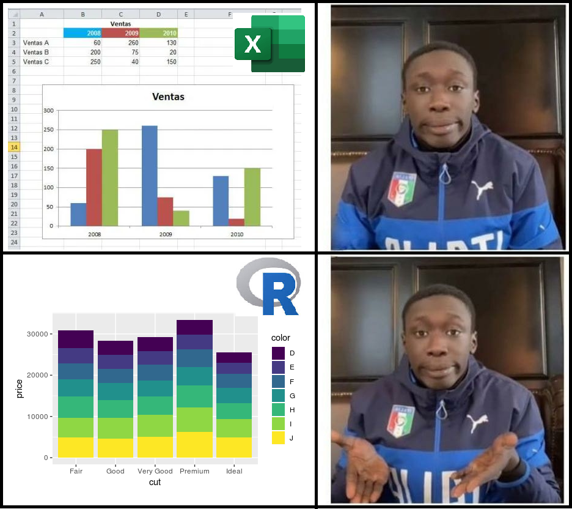
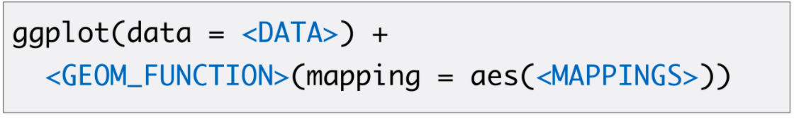

---
output:
  xaringan::moon_reader:
    seal: false
    css: [default2.css,rladie.css, rladies-font.css, custom.css]
    nature:
      ratio: 16:9
      highlightStyle: github
      highlightLines: true
      countIncrementalSlides: false
      slideNumberFormat: |
        <div class="progress-bar-container">
          <div class="progress-bar" style="width: calc(%current% / %total% * 170%);">
          </div>
        </div>
---

```{r xaringan-panelset, echo=FALSE}
xaringanExtra::use_panelset()
```

```{r xaringanExtra-clipboard, echo=FALSE}
xaringanExtra::use_clipboard()
```

```{r xaringanExtra-search, echo=FALSE}
xaringanExtra::use_search(show_icon = TRUE)
```

```{r xaringan-animate-css, echo=FALSE}
xaringanExtra::use_animate_css()
```

```{r setup, include=FALSE}
knitr::opts_chunk$set(fig.dim=c(5.5, 4.5), 
                      # fig.retina=2, 
                      out.width="100%",
                      dev="svg")
library(tidyverse)
library(ggplot2)
library(kableExtra)
library(tidyverse,warn.conflicts = F,verbose = F,quietly = T)
library(aweek)
library(janitor)

data_fallecidos <- read.csv2('data/fallecidos_covid.csv', encoding = 'UTF-8')
```


background-image: url(imagenes/INICIAL.png)
background-size:100%
---
class: inverse, center, middle
background-image: url(imagenes/fondo_good.png)
background-size: cover
# Visualización de datos con

### JPierre Velásquez
.large[CDC | 25-08-2021]

```{css echo=FALSE}
.pull-left {
  float: left;
  width: 47%;
}
.pull-right {
  float: right;
  width: 47%;
}
.pull-right ~ p {
  clear: both;
}
```

---

class: center, middle, animated fadeOutLeft
layout: false


# Objetivos

</br>

### Reforzar conceptos claves para entender el funcionamiento de ggplot2

--

layout: false

### Aprender a realizar gráficas simples sin mayores esfuerzos

--

layout: false

### Mostrar como elaborar gráficas con varios detalles

---
class: inverse,  center, middle

```{r, echo=FALSE, fig.cap="", out.width = '50%'}
knitr::include_graphics("https://memegenerator.net/img/instances/50468368/su-nivel-de-concentracin-es-impresionante-.jpg")
```

---
layout: false

background-image: url(https://ggplot2.tidyverse.org/logo.png)
background-position: 90% 3%
background-size: 7%

# Introducción a ggpplot2

.panelset[
.panel[.panel-name[Repaso]

`¿Recuerdan el concepto de estos elementos?`

- **Función:** Una función es un conjunto de sentencias organizadas para realizar una tarea específica.

```{r, eval=F}
# Función mean()
mean(c(1,2,3,4,5))
# Función sample()
sample(x = 1:10, size = 2)
```

- **Librería o paquete:** Son colecciones de funciones de un tema específico.

```{r, eval=F}
# Instalar
install.packages('lubridate')
# Cargar libreria
library(lubridate)
```

- **Data frame:**  Es una estructura compuesta de 2 dimensiones (filas y columnas) en donde cada columna puede tener diferentes tipos de datos.

    - Es la estructura de datos que se utiliza con más frecuencia para el análisis de datos.

]


.panel[.panel-name[¿Qué es ggplot2?]

#### Es un paquete dedicado a la visualización de datos de manera gráfica


```{r, fig.align='center', out.width='45%', echo=F}
# url
knitr::include_graphics("https://alastairrushworth.github.io/exploring_eda/ggplot2_exploratory.png") 
```

]

.panel[.panel-name[¿Por qué usar ggplot2?]


.pull-left[

- Permite mejorar en gran medida la calidad y la estética de sus gráficos (como la resolución de salida).
    
- Permite realizar gráficos complejos de forma simple.

- Permite construir múltiples gráficos en uno solo de manera simple.

- Permite construir casi cualquier tipo de gráfico.

- `Puedes hacer gifts (animaciones) :D`

```{r, fig.align='center', out.width='50%', echo=F}
# url
knitr::include_graphics("https://www.cursosgis.com/wp-content/uploads/4.gif") 
```


]

.pull-right[


```{r, fig.align='center', out.width='100%', echo=F}
# url
 
```

]

]

]

---
class: inverse, center, middle

### `Realizaremos visualizaciones gráficas de los datos libres de COVID-19`

```{r, echo=FALSE, fig.cap="", out.width = '45%'}
knitr::include_graphics("https://www.revistalugardeencuentro.com/wp/wp-content/uploads/2020/08/Vector-de-Salud-creado-por-freepik-www.freepik.es_.jpg")
```

---

layout: false

background-image: url(https://ggplot2.tidyverse.org/logo.png)
background-position: 90% 3%
background-size: 7%

# Visualización de datos con ggplot2

.panelset[
.panel[.panel-name[P1: Elementos básicos]

.pull-left[

#### Cualquier gráfico puede basarse en la combinación de:

- **Data:** data frame con los datos a graficar
- **Mapeo estético:** se compone principalmente en definir las coordenadas x – y
- **Geometria:** El tipo de gráfico que desea realizar

```{r, fig.align='center', out.width='100%', echo=F}
# url
 
```

```{r, include=F}
data_fallecidos_clean <- data_fallecidos %>% 
  clean_names() %>% 
  select(-fecha_corte, -id_persona) %>% 
  filter(edad_declarada >= 0 & edad_declarada <= 110,
         sexo == 'FEMENINO' | sexo == 'MASCULINO') %>% 
  mutate(fecha_fallecimiento = as.Date(as.character(fecha_fallecimiento), format = '%Y%m%d')) %>% 
  rename(fecha = fecha_fallecimiento, edad = edad_declarada)

```
_______________

```{r}
fallecidos_fecha <- data_fallecidos_clean %>% 
  count(fecha, name = 'fallecidos')
```


```{r plot-label, eval=FALSE}
ggplot(data=fallecidos_fecha)+
  geom_col(mapping = aes(x= fecha, y= fallecidos))
```

]

.pull-right[

```{r plot-label-out, ref.label="plot-label", echo=FALSE}
```

]


]

.panel[.panel-name[P2: Capas complemetarias]

.pull-left[

- `labs()`
- `theme_...()`

______________

```{r, include=T}
fallecidos_fecha <- data_fallecidos_clean %>% 
  count(fecha, name = 'fallecidos')
```

```{r plot-label2, eval=FALSE}
ggplot(data=fallecidos_fecha)+
  geom_col(mapping = aes(x= fecha, y= fallecidos))+
  labs(x = 'Fecha (días)',
       y = 'N° de fallecidos',
       title = 'Tendencia de fallecidos por COVID-19',
       caption = 'Fuente: SUSALUD')+
  theme_bw()
```

]

.pull-right[

```{r plot-label2-out, ref.label="plot-label2", echo=FALSE}
```

]

]

.panel[.panel-name[P3: Tipos de gráficos]

**[Cheatsheet ggplot2](https://www.maths.usyd.edu.au/u/UG/SM/STAT3022/r/current/Misc/data-visualization-2.1.pdf
)**: click para mas info

```{r, fig.align='center', out.width='50%', echo=F}
# url
knitr::include_graphics("https://static.docsity.com/documents_first_pages/2020/10/09/fbfc4df27eccd1f0f56dcbf27df5f666.png
") 
```

]

.panel[.panel-name[P4: Estéticas]


.pull-left[

- `color`
- `fill`
- `size`
- `shape`

______________

```{r, include= T}
falle_fecha_sexo <- data_fallecidos_clean %>% 
  count(fecha, sexo, name = 'fallecidos')
```


```{r plot-label3, eval=FALSE}
ggplot(data = falle_fecha_sexo) +
  geom_col(mapping = aes(x= fecha,
                         y = fallecidos,
                         fill = sexo))+
  labs(x = 'Criterio', y = 'N° de fallecidos',
       title = 'Tendencia de fallecidos por sexo',
       caption = 'Fuente: SUSALUD',
       fill = 'Sexo')+
  theme_classic()
```

]

.pull-right[

```{r plot-label3-out, ref.label="plot-label3", echo=FALSE}
```

]

]


.panel[.panel-name[P5: Escalas]


.pull-left[

- `scale_x_...` / `scale_ y_...`
- `scale_fill_...`
- `scale_color_...`
- `scale_size_...`

______________

```{r, include= T}
falle_fecha_sexo <- data_fallecidos_clean %>% 
  count(fecha, sexo, name = 'fallecidos')
```


```{r plot-label4, eval=FALSE}
ggplot(data = falle_fecha_sexo) +
  geom_col(mapping = aes(x= fecha,
                         y = fallecidos,
                         fill = sexo))+
  labs(x = 'Criterio', y = 'N° de fallecidos',
       title = 'Tendencia de fallecidos por sexo',
       caption = 'Fuente: SUSALUD',
       fill = 'Sexo')+
  theme_classic()+
  scale_y_continuous(breaks = seq(0, 1000, 100)) +
  scale_x_date(date_breaks = '2 month', date_labels = '%y/%m')
```

]

.pull-right[

```{r plot-label4-out, ref.label="plot-label4", echo=FALSE}
```

]

]

.panel[.panel-name[Extra]

.pull-left[

```{r plot-label5, eval=FALSE}
data_fallecidos_clean %>% 
  count(fecha, clasificacion_def, name = 'fallecidos') %>% 
  ggplot() +
  geom_tile(mapping = aes(x= fecha,
                         y = clasificacion_def,
                         fill = fallecidos), alpha = 1)+
  labs(x = 'Fecha', y = 'Criterio de defuncion',
       title = 'Mapa de calor de fallecidos por criterio',
       caption = 'Fuente: SUSALUD')+
  theme_classic()+
  scale_x_date(date_breaks = '4 month', date_labels = '%y/%m')+
  scale_fill_viridis_c()
```

]

.pull-right[

```{r plot-label5-out, ref.label="plot-label5", echo=FALSE}
```

]

]

]

---
class: inverse,  center, middle

# `¡Gracias por su atención!`

```{r, echo=FALSE, fig.cap="", out.width = '70%'}
knitr::include_graphics("http://wegamers.176.com/GameIM/SNS/Image/20402358211595235926405967")
```

